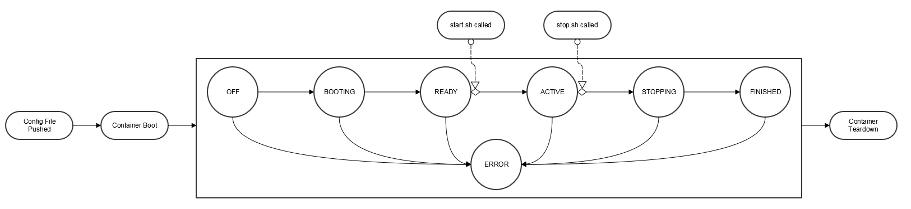

https://spectrumcollaborationchallenge.com

# Radio Command and Control (C2) API
## RadioAPI Overview

The RadioAPI consists of a set of scripts that reside in competitor containers and are called by the Phase 2 Hurdle framework using commands in the form of

```bash
lxc exec <container name> /root/radio_api/<script name>
```

The RadioAPI provides a means for the Phase 2 Hurdle framework to control aspects of competitors' containers in support of automated testing. Competitors can write script files that are called by the Phase 2 Hurdle framework at various points during the hurdle execution. This document provides more information for competitors on the format of those scripts.

 
## Radio States

* **OFF** - radio has not begun the booting process
* **BOOTING** - radio is starting up
* **READY** - radio has started up and is waiting for a call to start.sh
* **ACTIVE** - radio has received start.sh call and is running normally and is free to transmit
* **STOPPING** - radio has received call to stop.sh and is executing shutdown activities
* **FINISHED** - radio has completed shutdown activities
* **ERROR** - radio has encountered an error
 
## Radio State Diagram

While the defined commands can be called at any time and should be handled appropriately, typically commands will be called in the following states:

*  **start.sh** - called while radio is in the READY state to start the match, but can be called when the radio is in the OFF or BOOTING state if it is taking too long to get to the READY state
*  **stop.sh** - called while radio is in the ACTIVE state to end the match, but can be called when the radio is in the OFF, BOOTING, or ACTIVE state to abort the match
*  **status.sh** - called at any time to check on radio state
 

See the diagram below for a notional radio life cycle.



The following timing limits will be enforced:

* The radio has five minutes to get to READY once the container is booted
* If it is not READY at five minutes, start.sh will be called anyway.
* The radio has two minutes to prepare and save logs once stop.sh is called.
* If it is not FINISHED within two minutes, the container will be stopped anyway.

 
## Radio Command and Control (C2) API Requirements

* Competitor radios must support the Radio C2 API to properly function in the Hurdle
* The Radio C2 API is implemented only through scripts in the competitor container 
* The Phase 2 Hurdle framework uses the API by calling the required script files in the competitor container
* Competitors must implement all scripts
* All scripts must be located in /root/radio_api/ 

 
## Radio C2 API Details

The C2 API consists of the following interactions:

* colosseum_config.ini: Automatically generated configuration file based on the Phase 2 Hurdle settings, passed to container before it boots
* radio.conf: user defined file to be pushed into container before boot. Note: While competitors are encouraged to store configuration settings in a radio.conf file, this will not actually be required for the Phase 2 Hurdle. This is a Colosseum specific requirement.
* start.sh: called when the scenarios start (RF, traffic, collaboration, etc.), this will be after the container has booted 
* stop.sh: called when the radio should prepare for container teardown
* status.sh: called to receive radio state information for system awareness and expects a JSON message to be returned to standard output

 

The contents of the configuration file and scripts are up to the competitors (i.e. the scripts can call a radio driver directly, or they can execute a python script that interfaces with the radio). Script inputs and outputs are pre-defined and discussed below.
 
## colosseum_config.ini

colosseum_config.ini is an automatically generated configuration file based on the Phase 2 Hurdle settings. This file is passed to the container before boot.  The path and file name is /root/radio_api/colosseum_config.ini. An example of this file is below:

```ini
[RF]
rf_bandwidth = 1000000.0
center_frequency = 1000000000.0

[COLLABORATION]
collab_client_port = 5557
collab_peer_port = 5558
collab_server_port = 5556
collab_server_ip = 172.30.101.1

[ENVSIM]
envsim_port = 52004
envsim_ip = 192.168.40.2
``` 
 
## radio.conf

radio.conf is an optional radio configuration file. Nothing in the Phase 2 Hurdle framework will be parsing the configuration file.
 
## start.sh

start.sh is called when the hurdle evaluation begins (i.e. the radio is free to transmit). It is advised that the radio has already booted via the container initialization process and is waiting for start.sh to be called. Prior to the start of hurdle evaluation, the RF environment simulator will block any RF transmitted by competitor containers. When hurdle evaluation begins, the RF environment simulator will start and competitor containers will be able to access the RF environment. start.sh will not accept any inputs. The exit code will be logged by the Phase 2 Hurdle Framework. 

* inputs: none
* outputs: exit status (0 for success), stdout and stderr may be logged
 
## stop.sh

stop.sh is called when hurdle evalutaion is over and the radio has 2 minutes to prepare for container teardown (i.e. collect logs). The script will not accept any inputs. The exit code will be logged by the Phase 2 Hurdle framework.

After 2 minutes the container will begin the teardown process without further notification.

* inputs: none
* outputs: exit status (0 for success), stdout and stderr may be logged
 
## status.sh

status.sh is called to retrieve the current state of the radio (i.e. is it ready to begin the hurdle). The script will not accept any inputs. Status should be returned by way of stdout and must contain one of the pre-defined states with an optional detailed message. The exit code will be logged by the Phase 2 Hurdle framework.

Competitors must write a JSON dictionary to stdout, with two entries: 'STATUS', which is one of the Radio States defined above and an 'INFO' entry. An example JSON output to standard out is below:

```python
{
  "STATUS": "READY"
  "INFO": "Everything is Awesome"  
} 
```
 
* inputs: none
* outputs: exit status (0 for success), json status on stdout, stderr will not be logged

Note: the status json dictionary must contain a 'STATUS' entry listing a pre-defined state along with an 'INFO' entry which will be length limited (TBD)
