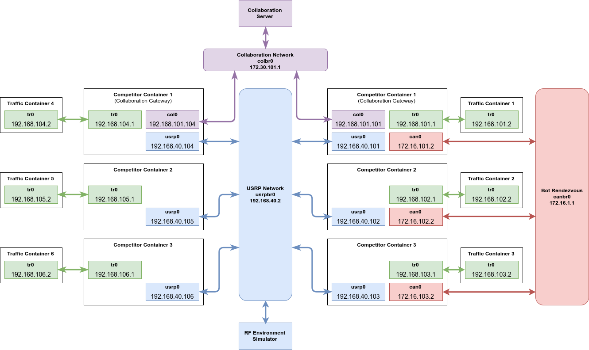
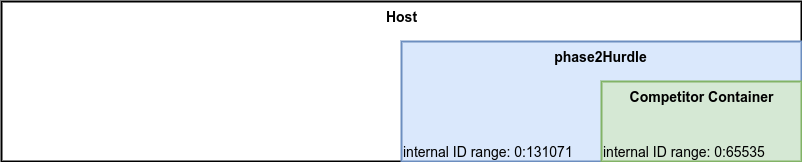

https://spectrumcollaborationchallenge.com

# Phase 2 Hurdle Container Detailed Specification

## Embedded Documentation
The documentation associated with the version of the Phase 2 Hurdle software is included in the
docs subdirectory of the Phase 2 Hurdle Git repository. This is accessible on the web at
https://github.com/spectrumcollaborationchallenge/phase2-hurdle and is installed in the Phase 2
Hurdle container at /root/phase2-hurdle/docs/.

The Phase 2 Hurdle container also makes these markdown documents available as rendered web pages.
Get the IP address of the container's eth0 interface by running

```bash
lxc list
```

The markdown server is listening on port 8000. If we assume the Phase 2 Hurdle container has an
IP address of 10.169.25.230, you could access the documentation from your host machine by pointing a
web browser to [http://10.169.25.230:8000](http://10.169.25.230:8000)

## Networking

The following sections will show the Phase 2 Hurdle container's network map and routing tables to
help competitors understand the Phase 2 Hurdle infrastructure.

### Top Level Container ifconfig
See below for example output of running ifconfig on the top level container. See the network map
later in this document for more insight into what each interface is used for.

```text
canbr0    Link encap:Ethernet  HWaddr ee:3c:1f:a3:58:3c
          inet addr:172.16.1.1  Bcast:0.0.0.0  Mask:255.255.0.0
          inet6 addr: fe80::ec3c:1fff:fea3:583c/64 Scope:Link
          UP BROADCAST RUNNING MULTICAST  MTU:1500  Metric:1
          RX packets:0 errors:0 dropped:0 overruns:0 frame:0
          TX packets:8 errors:0 dropped:0 overruns:0 carrier:0
          collisions:0 txqueuelen:1000
          RX bytes:0 (0.0 B)  TX bytes:648 (648.0 B)

colbr0    Link encap:Ethernet  HWaddr ba:64:a9:b7:c3:1c
          inet addr:172.30.101.1  Bcast:0.0.0.0  Mask:255.255.255.0
          inet6 addr: fe80::b864:a9ff:feb7:c31c/64 Scope:Link
          UP BROADCAST RUNNING MULTICAST  MTU:1500  Metric:1
          RX packets:0 errors:0 dropped:0 overruns:0 frame:0
          TX packets:8 errors:0 dropped:0 overruns:0 carrier:0
          collisions:0 txqueuelen:1000
          RX bytes:0 (0.0 B)  TX bytes:648 (648.0 B)

eth0      Link encap:Ethernet  HWaddr 00:16:3e:06:07:2d
          inet addr:10.169.25.230  Bcast:10.169.25.255  Mask:255.255.255.0
          inet6 addr: fe80::216:3eff:fe06:72d/64 Scope:Link
          UP BROADCAST RUNNING MULTICAST  MTU:1500  Metric:1
          RX packets:564 errors:0 dropped:0 overruns:0 frame:0
          TX packets:102 errors:0 dropped:0 overruns:0 carrier:0
          collisions:0 txqueuelen:1000
          RX bytes:90741 (90.7 KB)  TX bytes:8776 (8.7 KB)

lo        Link encap:Local Loopback
          inet addr:127.0.0.1  Mask:255.0.0.0
          inet6 addr: ::1/128 Scope:Host
          UP LOOPBACK RUNNING  MTU:65536  Metric:1
          RX packets:0 errors:0 dropped:0 overruns:0 frame:0
          TX packets:0 errors:0 dropped:0 overruns:0 carrier:0
          collisions:0 txqueuelen:1
          RX bytes:0 (0.0 B)  TX bytes:0 (0.0 B)

trbr1     Link encap:Ethernet  HWaddr 00:00:00:00:00:00
          inet addr:192.168.101.100  Bcast:0.0.0.0  Mask:255.255.255.0
          inet6 addr: fe80::f468:ccff:feed:24b9/64 Scope:Link
          UP BROADCAST MULTICAST  MTU:1500  Metric:1
          RX packets:8 errors:0 dropped:0 overruns:0 frame:0
          TX packets:10 errors:0 dropped:0 overruns:0 carrier:0
          collisions:0 txqueuelen:1000
          RX bytes:536 (536.0 B)  TX bytes:828 (828.0 B)

trbr2     Link encap:Ethernet  HWaddr 2a:4b:8b:6c:d3:85
          inet addr:192.168.102.100  Bcast:0.0.0.0  Mask:255.255.255.0
          inet6 addr: fe80::284b:8bff:fe6c:d385/64 Scope:Link
          UP BROADCAST RUNNING MULTICAST  MTU:1500  Metric:1
          RX packets:0 errors:0 dropped:0 overruns:0 frame:0
          TX packets:8 errors:0 dropped:0 overruns:0 carrier:0
          collisions:0 txqueuelen:1000
          RX bytes:0 (0.0 B)  TX bytes:648 (648.0 B)

trbr3     Link encap:Ethernet  HWaddr be:05:25:b6:5f:c1
          inet addr:192.168.103.100  Bcast:0.0.0.0  Mask:255.255.255.0
          inet6 addr: fe80::bc05:25ff:feb6:5fc1/64 Scope:Link
          UP BROADCAST RUNNING MULTICAST  MTU:1500  Metric:1
          RX packets:0 errors:0 dropped:0 overruns:0 frame:0
          TX packets:8 errors:0 dropped:0 overruns:0 carrier:0
          collisions:0 txqueuelen:1000
          RX bytes:0 (0.0 B)  TX bytes:648 (648.0 B)

trbr4     Link encap:Ethernet  HWaddr 42:77:73:9c:7b:08
          inet addr:192.168.104.100  Bcast:0.0.0.0  Mask:255.255.255.0
          inet6 addr: fe80::4077:73ff:fe9c:7b08/64 Scope:Link
          UP BROADCAST RUNNING MULTICAST  MTU:1500  Metric:1
          RX packets:0 errors:0 dropped:0 overruns:0 frame:0
          TX packets:8 errors:0 dropped:0 overruns:0 carrier:0
          collisions:0 txqueuelen:1000
          RX bytes:0 (0.0 B)  TX bytes:648 (648.0 B)

trbr5     Link encap:Ethernet  HWaddr a6:1f:43:c9:fb:25
          inet addr:192.168.105.100  Bcast:0.0.0.0  Mask:255.255.255.0
          inet6 addr: fe80::a41f:43ff:fec9:fb25/64 Scope:Link
          UP BROADCAST RUNNING MULTICAST  MTU:1500  Metric:1
          RX packets:0 errors:0 dropped:0 overruns:0 frame:0
          TX packets:8 errors:0 dropped:0 overruns:0 carrier:0
          collisions:0 txqueuelen:1000
          RX bytes:0 (0.0 B)  TX bytes:648 (648.0 B)

trbr6     Link encap:Ethernet  HWaddr 86:9c:ea:6f:e9:f6
          inet addr:192.168.106.100  Bcast:0.0.0.0  Mask:255.255.255.0
          inet6 addr: fe80::849c:eaff:fe6f:e9f6/64 Scope:Link
          UP BROADCAST RUNNING MULTICAST  MTU:1500  Metric:1
          RX packets:0 errors:0 dropped:0 overruns:0 frame:0
          TX packets:8 errors:0 dropped:0 overruns:0 carrier:0
          collisions:0 txqueuelen:1000
          RX bytes:0 (0.0 B)  TX bytes:648 (648.0 B)

usrpbr0   Link encap:Ethernet  HWaddr f2:ee:6d:f6:70:84
          inet addr:192.168.40.2  Bcast:0.0.0.0  Mask:255.255.255.0
          inet6 addr: fe80::f0ee:6dff:fef6:7084/64 Scope:Link
          UP BROADCAST RUNNING MULTICAST  MTU:1500  Metric:1
          RX packets:0 errors:0 dropped:0 overruns:0 frame:0
          TX packets:8 errors:0 dropped:0 overruns:0 carrier:0
          collisions:0 txqueuelen:1000
          RX bytes:0 (0.0 B)  TX bytes:648 (648.0 B)
```

### Competitor Container Network Interfaces

As a reminder, competitors submit a single image to run in the Phase 2 Hurdle. The Phase 2 Hurdle framework will instantiate 3 containers based on that image.

Competitors **must** ensure that each instance of their image will automatically configure its routing table appropriately for the interaces and IP addresses it is given.

The Phase 2 Hurdle container will add the following network interfaces to competitor containers as they are initialized:

| Interface Name | IP Address Pattern           |
|----------------|------------------------------|
| tr0            | 192.168.{container octet}.1  |
| usrp0          | 192.168.40.{container octet} |
| col0           | 192.168.101.{container octet}|

In this table, container octect ranges between 104 and 106.

Note that col0 is only available on the node designated as the Collaboration gateway. **Competitors should use the existence of the col0 interface to determine that a node is the Collaboration gateway**. This interface is used to communicate with the Collaboration Server and with the bot network's Collaboration gateway.

You can inspect the settings used for each interface by reviewing the interface config files named competitor-hurdle-srn{node number}_{interface name}0.cfg in /root/phase2-hurdle/hurdle_execution/ after the completion of a hurdle run.

### Network Map

The network map below calls out the interfaces and networks used by all the subcontainers in the
Phase 2 Hurdle container.




### Routing Tables

The following two sections contain exports of the routing tables used in the top level Phase 2
Hurdle container and from one of the traffic generator containers.

#### Top Level Container Routing Table

This routing table sets up the tr0 interface for each bot or competitor container as the default
gateway for its dedicated subnet. This ensures that all traffic addressed to a traffic generator
will be forwarded to the appropriate bot or competitor container.

```text
Kernel IP routing table
Destination     Gateway         Genmask         Flags Metric Ref    Use Iface
default         10.169.25.1     0.0.0.0         UG    0      0        0 eth0
10.169.25.0     *               255.255.255.0   U     0      0        0 eth0
172.16.0.0      *               255.255.0.0     U     0      0        0 canbr0
172.30.101.0    *               255.255.255.0   U     0      0        0 colbr0
192.168.40.0    *               255.255.255.0   U     0      0        0 usrpbr0
192.168.101.0   192.168.101.1   255.255.255.0   UG    0      0        0 trbr1
192.168.101.0   *               255.255.255.0   U     0      0        0 trbr1
192.168.102.0   192.168.102.1   255.255.255.0   UG    0      0        0 trbr2
192.168.102.0   *               255.255.255.0   U     0      0        0 trbr2
192.168.103.0   192.168.103.1   255.255.255.0   UG    0      0        0 trbr3
192.168.103.0   *               255.255.255.0   U     0      0        0 trbr3
192.168.104.0   192.168.104.1   255.255.255.0   UG    0      0        0 trbr4
192.168.104.0   *               255.255.255.0   U     0      0        0 trbr4
192.168.105.0   192.168.105.1   255.255.255.0   UG    0      0        0 trbr5
192.168.105.0   *               255.255.255.0   U     0      0        0 trbr5
192.168.106.0   192.168.106.1   255.255.255.0   UG    0      0        0 trbr6
192.168.106.0   *               255.255.255.0   U     0      0        0 trbr6
```

#### Traffic Generator Routing Table

Each traffic generator is configured such that any traffic addressed to an IP address beginning with
192.168.x.x will be forwarded to 192.168.**{container octet}**.1, using the traffic generator's tr0
interface. We defined **{container octet}** as the subnet of the associated bot or competitor
container. Subnets 101 - 103 are associated with bot containers and subnets 104 - 106 are associated
with competitor containers. The IP address of 192.168.**{container octet}**.1 is always defined as
the IP address of the **tr0** interface in bot and competitor containers.

See below for an example of the routing table used in the first traffic generator, tgen1.

```text
Kernel IP routing table
Destination     Gateway         Genmask         Flags Metric Ref    Use Iface
192.168.0.0     192.168.101.1   255.255.0.0     UG    0      0        0 tr0
192.168.101.0   *               255.255.255.0   U     0      0        0 tr0
```

## Traffic Generation

Each bot and competitor container is assigned a dedicated traffic generation container. These containers are named tgen1 through tgen6. Each traffic generation container has a single IP interface, named tr0. The IP addresses tr0 in the tgen containers are assigned with the following schema: 192.168.**{container octet}**.2. These subnets start at 101 with tgen1 and increment up to 106 at tgen6.

Each traffic generator container runs an instance of MGEN to generate IP traffic for the hurdle. See the [MGEN Homepage](https://www.nrl.navy.mil/itd/ncs/products/mgen) for more information on MGEN.

## Bot Containers

Each run of the hurdle uses three bot containers. Each bot container is based on an **identical** image. The bot image comes in two varients, the Practice bot and the Hurdle bot. The Practice bot is available for use immediately. The Hurdle bot, used for official scoring runs, will be available at a later date.

Bots interact with the RF environment simulator using IPs 192.168.40.101 through 192.168.40.103. Bots interact with traffic generator containers tgen1 through tgen3. The bot at 192.168.101.101 is the bot network's Collaboration gateway.


## Competitor Containers

Each run of the hurdle uses three competitor containers. Each competitor container is based on an **identical** image, provided by the competitor.

The competitor container that has a col0 interface is the container designated as the Collaboration gateway.


## Collaboration Server

The Collaboration server is a service running in the Phase 2 Hurdle container. It listens for connections from collaboration gateway nodes on the port and IP specified in each container's /root/radio_api/colosseum_config.ini


## LXD

The Phase 2 Hurdle is provided as a single LXD container with several sub containers. See below for
what to expect in terms of the images and containers to find in the Phase 2 Hurdle container.


### Image List

The Phase 2 Hurdle container includes two images by default. The dummy-image is used only for the initial proof of life test
for checking out your LXD configuration. The ubuntu/xenial image is used for traffic generators.

On a freshly downloaded phase2Hurdle container, verify the current image list by logging in to the phase2Hurdle container
from your host with

```bash
lxc exec phase2Hurdle bash
```

and then run this command inside the phase2Hurdle container:

```bash
lxc image list
```

You should see something similar to:

```text
+------------------------------+--------------+--------+-------------------------------------------------+--------+-----------+-------------------------------+
|            ALIAS             | FINGERPRINT  | PUBLIC |                   DESCRIPTION                   |  ARCH  |   SIZE    |          UPLOAD DATE          |
+------------------------------+--------------+--------+-------------------------------------------------+--------+-----------+-------------------------------+
| dummy-image                  | 2d8b3108e906 | no     | ubuntu xenial x86_64 (default) (20170913_03:49) | x86_64 | 127.46MB  | Sep 19, 2017 at 8:48pm (UTC)  |
+------------------------------+--------------+--------+-------------------------------------------------+--------+-----------+-------------------------------+
| ubuntu/xenial (3 more)       | 105373777c90 | no     | Ubuntu xenial amd64 (20170913_03:49)            | x86_64 | 92.50MB   | Sep 14, 2017 at 12:37am (UTC) |
+------------------------------+--------------+--------+-------------------------------------------------+--------+-----------+-------------------------------+
```


### Container List

Before running the hurdle container traffic initialization script, there will be no containers instantiated
in the Phase 2 Hurdle container. After running the container initialization script, the output of this command in the Phase 2 Hurdle container:

```bash
lxc list
```

should be similar to this:

```text
+---------------------+---------+------+------+------------+-----------+
|        NAME         |  STATE  | IPV4 | IPV6 |    TYPE    | SNAPSHOTS |
+---------------------+---------+------+------+------------+-----------+
| tgen1               | STOPPED |      |      | PERSISTENT | 0         |
+---------------------+---------+------+------+------------+-----------+
| tgen2               | STOPPED |      |      | PERSISTENT | 0         |
+---------------------+---------+------+------+------------+-----------+
| tgen3               | STOPPED |      |      | PERSISTENT | 0         |
+---------------------+---------+------+------+------------+-----------+
| tgen4               | STOPPED |      |      | PERSISTENT | 0         |
+---------------------+---------+------+------+------------+-----------+
| tgen5               | STOPPED |      |      | PERSISTENT | 0         |
+---------------------+---------+------+------+------------+-----------+
| tgen6               | STOPPED |      |      | PERSISTENT | 0         |
+---------------------+---------+------+------+------------+-----------+
```


### Obtaining and Installing the Latest Practice Bot Image
These commands must be run every time there is an update to the bots. These commands will push the new image file into the phase2Hurdle container, remove the existing bots, and install the new bot version. This will allow
you to independently update practice bots and hurdle bots.

You can move files into the phase2Hurdle container using LXD commands. To copy the darpa-practice-srn-base-v1-0.tar.gz file into
the phase2Hurdle container, run the following command on your host:

```bash
lxc file push darpa-practice-srn-base-v1-0.tar.gz phase2Hurdle/share/nas/competitor/images/
```

This copies the file from the host and puts it in the /share/nas/competitor/images/ directory of the
phase2Hurdle container.


To remove the existing old versions of the bot containers from the phase2Hurdle container, and install the new version, run the following commands:


First get a bash prompt inside the phase2Hurdle container by running this on your host.

```bash
lxc exec phase2Hurdle bash
```

Next run:

```bash
cd /root/phase2-hurdle/container_configuration/bot_containers
./configure_bots.py --bot-type=practice --image-name=darpa-practice-srn-base-v1-0.tar.gz
```

This will remove any prexisting "practice" containers, import the darpa-practice-srn-base-v1-0.tar.gz image from /share/nas/competitor/images/, and configure 3 instances of the new practice bot version.

When this command is complete, verify that you see all of these containers by running the following command from the root terminal in the phase2Hurdle container:

```bash
lxc list
```

You should see something similar to:

```bash
+---------------------+---------+------+------+------------+-----------+
|        NAME         |  STATE  | IPV4 | IPV6 |    TYPE    | SNAPSHOTS |
+---------------------+---------+------+------+------------+-----------+
| darpa-practice-srn1 | STOPPED |      |      | PERSISTENT | 0         |
+---------------------+---------+------+------+------------+-----------+
| darpa-practice-srn2 | STOPPED |      |      | PERSISTENT | 0         |
+---------------------+---------+------+------+------------+-----------+
| darpa-practice-srn3 | STOPPED |      |      | PERSISTENT | 0         |
+---------------------+---------+------+------+------------+-----------+
| tgen1               | STOPPED |      |      | PERSISTENT | 0         |
+---------------------+---------+------+------+------------+-----------+
| tgen2               | STOPPED |      |      | PERSISTENT | 0         |
+---------------------+---------+------+------+------------+-----------+
| tgen3               | STOPPED |      |      | PERSISTENT | 0         |
+---------------------+---------+------+------+------------+-----------+
| tgen4               | STOPPED |      |      | PERSISTENT | 0         |
+---------------------+---------+------+------+------------+-----------+
| tgen5               | STOPPED |      |      | PERSISTENT | 0         |
+---------------------+---------+------+------+------------+-----------+
| tgen6               | STOPPED |      |      | PERSISTENT | 0         |
+---------------------+---------+------+------+------------+-----------+
```

Confirm that the containers are based on the correct image by running:

```bash
lxc config get darpa-practice-srn1 volatile.base_image
```

This will output the full fingerprint of the container's base image. Compare the start of this
fingerprint against the fingerprint shown next to the appropriate image version when you run:

```bash
lxc image list
```

You'll see something similar to the following:

```text
+------------------------------+--------------+--------+-------------------------------------------------+--------+-----------+-------------------------------+
|            ALIAS             | FINGERPRINT  | PUBLIC |                   DESCRIPTION                   |  ARCH  |   SIZE    |          UPLOAD DATE          |
+------------------------------+--------------+--------+-------------------------------------------------+--------+-----------+-------------------------------+
| darpa-practice-srn-base-v1-1 | b84fbecba521 | no     |                                                 | x86_64 | 1272.84MB | Sep 20, 2017 at 4:20pm (UTC)  |
+------------------------------+--------------+--------+-------------------------------------------------+--------+-----------+-------------------------------+
| dummy-image                  | 2d8b3108e906 | no     | ubuntu xenial x86_64 (default) (20170913_03:49) | x86_64 | 127.46MB  | Sep 19, 2017 at 8:48pm (UTC)  |
+------------------------------+--------------+--------+-------------------------------------------------+--------+-----------+-------------------------------+
| ubuntu/xenial (3 more)       | 105373777c90 | no     | Ubuntu xenial amd64 (20170913_03:49)            | x86_64 | 92.50MB   | Sep 14, 2017 at 12:37am (UTC) |
+------------------------------+--------------+--------+-------------------------------------------------+--------+-----------+-------------------------------+
```

You can cross reference the alias and fingerprint for the practice bot against the Versions.md text file available at
https://github.com/SpectrumCollaborationChallenge/phase2-hurdle/releases/latest


### Linux ID Mapping
Linux systems assume they will have access to at least 65536 unique user IDs and group IDs to work properly. The standard LXD configuration provides subcontainers with a range of user IDs and group IDs starting at either 100000 or 165536 and spanning 65536 IDs, as seen in the root and lxd entries in /etc/subuid and /etc/subgid.

That is sufficient for a single layer of containers, but is a problem for nested containers as used in the Phase 2 Hurdle framework. As this framework uses two layers of containers, the top level container will need at least 2 x 65536 IDs. See the figure below for an illustration of the UID and GID mappings used in the containers in the Phase 2 Hurdle framework.



### Host ID Mapping Files
Example output of what the host's /etc/subuid should look like is shown below:

```text
lxd:165536:131072
root:165536:131072
```

Example output of what the host's /etc/subgid should look like is shown below:

```text
lxd:165536:131072
root:165536:131072
```

These files map all IDs in containers to an ID range starting at 165536 and spanning 131072 IDs, which is enough space for two 65536 ID range spans.

### Phase 2 Hurdle Container ID Mapping Files
Example output from the Phase 2 Hurdle container's /etc/subuid file is shown below:

```text
lxd:65536:65536
root:65536:65536
```

Example output from the Phase 2 Hurdle container's /etc/subgid file is shown below:

```text
lxd:65536:65536
root:65536:65536
```

These files map the IDs in subcontainers to beginning at Phase 2 Hurdle container ID 65536 and spanning 65536 IDs.

## OS

### Phase 2 Hurdle Container

The Phase 2 Hurdle container is based on a Ubuntu 16.04 LTS 64 bit image.

### Traffic Generator Images

The traffic generators use a Ubuntu 16.04 LTS 64 bit base image.

### Bot Containers

The bots are all currently based on Ubuntu 14.04 LTS 64 bit.

### Competitor Containers

The example base image provided in the Phase 2 Hurdle downloads is based on Ubuntu 14.04 LTS. Competitors are not required to use this base image, but the SC2 team will not provide any technical support with integrating solutions not based on Ubuntu 14.04 LTS.
