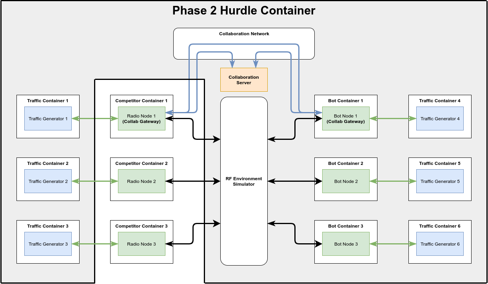

https://spectrumcollaborationchallenge.com

# Overview
This document will complement the [SC2 Phase 2 Hurdle Problem Description](https://spectrumcollaborationchallenge.com/wp-content/uploads/Phase-2-Hurdle-Problem-Description.pdf) by describing how to build, test, and submit solutions to the Phase 2 Entrance Hurdle.

The Phase 2 Hurdle framework is a simplified emulation of the SC2 Colosseum, consisting of a single LXC container incorporating an RF environment simulator, IP traffic generators, multiple independent IP networks, and automated hurdle execution scripts.



Team solutions must run in their own LXC container and interact with the Phase 2 Hurdle framework via network and Radio API interfaces. Teams will upload their solutions to team-specific buckets on Amazon S3 for official evaluation runs. Teams may download the Phase 2 Hurdle framework for local development and testing prior to uploading their solution for an official evaluation run.

Links to detailed specifications on the Phase 2 Hurdle framework can be found at the end of this document.

The following sections will explain how to download the DARPA Spectrum Collaboration Challenge Phase 2
Hurdle framework, incorporate and test solutions locally, and submit solutions for scoring.

# Table of Contents
1. [Obtaining the Phase 2 Hurdle Framework](#obtaining-the-phase-2-hurdle-framework)
2. [Preparing a Host Machine](#preparing-a-host-to-run-the-hurdle)
3. [Testing the Hurdle Configuration](#testing-the-hurdle-configuration)
4. [Implementing a Hurdle Solution](#implementing-a-hurdle-solution)
5. [Importing a Hurdle Solution Locally](#importing-a-hurdle-solution-locally)
6. [Running the Hurdle](#running-the-hurdle)
7. [Uploading a Hurdle Solution for Official Evaluation](#uploading-a-hurdle-solution-for-official-evaluation)
8. [Resources](#resources)


## Obtaining the Phase 2 Hurdle Framework
Teams are strongly encouraged to download the prebuilt Bot and Phase 2 Hurdle images hosted on GitHub rather than attempting to build and configure it from scratch using the code in this repository. This will ensure that all teams start from a known working baseline and will make any required updates much less error prone. The latest version of all containers can always be found at https://github.com/SpectrumCollaborationChallenge/phase2-hurdle/releases/latest

### Obtaining Credentials for S3
All teams must fill out the DARPA Spectrum Collaboration Challenge Phase 2 Long Form ( https://spectrumcollaborationchallenge.com/register-for-phase-2-open-track/ ) to sign up for Phase 2 and be granted credentials to upload their Phase 2 Hurdle solutions to S3.

Once teams submit the long form, they will receive an automated confirmation email. Prior to the beginning of the solution submission window, the Spectrum Collaboration Challenge team will generate S3 credentials for each team to use to upload Phase 2 Hurdle solutions to a dedicated bucket on Amazon S3.

### Downloading From GitHub
The Phase 2 Hurdle images are stored on GitHub and are split into multiple images to permit independent updates. Any time there is an update to the Phase 2 Hurdle images, the Spectrum Collaboration Challenge team will create a new release with the updated files. Teams may set up GitHub accounts to automatically notify them of any updates to the repository at https://github.com/SpectrumCollaborationChallenge/phase2-hurdle.

See the table below for a description of the files available for download:

| Filename                            | Summary |
|-------------------------------------|-------------|
| phase2Hurdle-vX-X.tar.gz            | Top level hurdle execution image |
| darpa-practice-srn-base-vX-X.tar.gz | Practice bot image |
| darpa-hurdle-srn-base-vX.X.tar.gz   | Hurdle bot image |
| competitor-base-vX.X.tar.gz         | Preconfigured "blank" Ubuntu 14.04 image |


#### phase2Hurdle-vX-X.tar.gz
This image contains all the Phase 2 Hurdle infrastructure code and is used to execute the hurdle. The other images will end up being installed into this top level container.

#### darpa-practice-srn-base-vX-X.tar.gz
This image contains the practice version of the bots which teams can use during their initial development.

#### darpa-hurdle-srn-base-vX.X.tar.gz
This image contains the hurdle version of the bots which teams will use to validate their solution prior to submitting it for an official scoring run. This image will be made available at a later date.

#### competitor-base-vX.X.tar.gz
This image is running Ubuntu 14.04 and has several hurdle dependencies preinstalled. Competitors are encouraged to use this as the basis for their solutions. This image includes GNU Radio, code to interface with the RF Environment simulator, and a skeleton of the files used in the Radio API.

These instructions will assume that teams have downloaded the Phase 2 Hurdle image version 1.0 and the Practice bot image version 1.0 to their local directory as ~/phase2Hurdle-v1-0-0.tar.gz and darpa-practice-srn-base-v1-0-0.tar.gz. These instructions will also walk through how to install the latest bot image to the Phase 2 Hurdle container.

## Preparing a Host to run the Hurdle
Teams must install a recent version of LXD to a Linux host and modify some default settings to run the Phase 2 Hurdle framework successfully. Teams must then import and launch the Phase 2 Hurdle container to begin developing and testing solutions locally.

### System Requirements
The Phase 2 Hurdle is very computationally intensive, as it will run 3 instances of your solution, 3 instances of an interactive radio bot, 6 traffic generators, and an RF environment simulator.

These instructions have been validated on systems running Ubuntu 16.04 64 bit and Ubuntu 14.04 64bit. For reference, the final evaluation will be run on an Amazon EC2 instance with specifications to be released along with the Hurdle Bots at a later date.

### Installing LXD
The Phase 2 Hurdle Framework uses LXC containers managed by the LXD daemon. These instructions require that you use a version of LXD at least as recent as 2.16. To get the most recent version stable of LXD, add the Ubuntu Containers Team PPA to your Ubuntu 16 package manager:

```bash
sudo add-apt-repository ppa:ubuntu-lxc/lxd-stable
sudo apt-get update
```

Install and initialize the most recent stable version of LXD with:

```bash
sudo apt install lxd
sudo lxd init
```

### Modifying System Configuration Files
The Phase 2 Hurdle container and the set of nested containers inside all run in unprivileged mode. LXD will map all the user IDs and group IDs used inside the containers to an offset range of IDs in the host. The range of values used for this ID mapping is controlled by the /etc/subuid and /etc/subgid files.

Linux systems assume they will have access to at least 65536 unique user IDs and group IDs to work properly. The standard LXD configuration provides subcontainers with a range of user IDs and group IDs starting at either 100000 or 165536 and spanning 65536 IDs, as seen in the root and lxd entries in /etc/subuid and /etc/subgid.

That is sufficient for a single layer of containers, but is a problem for nested containers as used in the Phase 2 Hurdle framework. As this framework uses two layers of containers, the top level container will need at least 2 x 65536 IDs. To enable this, edit the /etc/subgid and /etc/subuid files on your host. The following commands will make a backup copy of each file in your user's home directory, remove the root and lxd entries in each file, and update the entries with the necessary values.

Make a copy of the files in your home directory with:

```bash
cp /etc/subuid ~/subuid.old
cp /etc/subgid ~/subgid.old
```

Next replace the original root and lxd entries in each file.

```bash
sudo -s

sed -i '/^root:/d' /etc/subuid /etc/subgid
sed -i '/^lxd:/d' /etc/subuid /etc/subgid

echo "root:165536:131072" >> /etc/subuid
echo "lxd:165536:131072" >> /etc/subuid

echo "root:165536:131072" >> /etc/subgid
echo "lxd:165536:131072" >> /etc/subgid
```

Next, and this is important, restart the LXD service so that it will pick up the changes to these files. If you miss this step, the traffic, bot, and competitor containers will not be able to start. You will receive an error similar to

```bash
pylxd.exceptions.LXDAPIException: LXD doesn't have a uid/git allocation. In this mode, only privileged containers are supported.
```

Restart the LXD service by running the following command on your host:

```bash
sudo service lxd restart
```

### Import and Launch the Phase 2 Hurdle Container
In order to work with the Phase 2 Hurdle Framework, you must import the phase2Hurdle.tar.gz image into the LXD service running on your local host. If you've downloaded the Phase 2 Hurdle image to ~/phase2Hurdle.tar.gz, run the following command to import it into LXD:

```bash
lxc image import ~/phase2Hurdle-vX.X.tar.gz --alias=phase2Hurdle
```

You can confirm the import was successful by running:

```bash
lxc image list
```

You should see phase2Hurdle as one of the entries in that list.

Now launch an instance of the phase2Hurdle container and name it phase2Hurdle by running

```bash
lxc launch phase2Hurdle phase2Hurdle -c security.nesting=true
```

Confirm that the phase2Hurdle container launched successfully by running

```bash
lxc list
```

You should see something similar to
```bash
+------------------+---------+---------------------+------+------------+-----------+
|       NAME       |  STATE  |        IPV4         | IPV6 |    TYPE    | SNAPSHOTS |
+------------------+---------+---------------------+------+------------+-----------+
| phase2Hurdle     | RUNNING | 10.169.25.81 (eth0) |      | PERSISTENT | 0         |
+------------------+---------+---------------------+------+------------+-----------+
```

### Initialize the Phase 2 Hurdle Container
The Phase 2 Hurdle container must be initialized before its first use. This will generate 6 instances of traffic generator containers. To perform this one-time initialization, run the following command from your host system:

```bash
lxc exec phase2Hurdle bash
```

This will get you a root terminal session to the phase2Hurdle container without requiring you to log in. From that root terminal in the phase2Hurdle container, run:

```bash
cd /root/phase2-hurdle/container_configuration/
./hurdle_traffic_initialization.sh
```

This will initialize and configure 6 traffic generator containers, named tgen1 through tgen6.

When this command is complete, verify that you see all of these containers by running the following command from the root terminal in the phase2Hurdle container:

```bash
lxc list
```

You should see something similar to:

```bash
+---------------------+---------+------+------+------------+-----------+
|        NAME         |  STATE  | IPV4 | IPV6 |    TYPE    | SNAPSHOTS |
+---------------------+---------+------+------+------------+-----------+
| tgen1               | STOPPED |      |      | PERSISTENT | 0         |
+---------------------+---------+------+------+------------+-----------+
| tgen2               | STOPPED |      |      | PERSISTENT | 0         |
+---------------------+---------+------+------+------------+-----------+
| tgen3               | STOPPED |      |      | PERSISTENT | 0         |
+---------------------+---------+------+------+------------+-----------+
| tgen4               | STOPPED |      |      | PERSISTENT | 0         |
+---------------------+---------+------+------+------------+-----------+
| tgen5               | STOPPED |      |      | PERSISTENT | 0         |
+---------------------+---------+------+------+------------+-----------+
| tgen6               | STOPPED |      |      | PERSISTENT | 0         |
+---------------------+---------+------+------+------------+-----------+
```

### Install the Latest Practice Bot Image
These commands must be run every time there is an update to the bots. These commands will push the new image file into the phase2Hurdle container, remove the existing bots, and install the new bot version. This will allow
you to independently update practice bots and hurdle bots.

You can move files into the phase2Hurdle container using LXD commands. To copy the darpa-practice-srn-base-v1-0-0.tar.gz file into
the phase2Hurdle container, run the following command on your host:

```bash
lxc file push darpa-practice-srn-base-v1-0-0.tar.gz phase2Hurdle/share/nas/competitor/images/
```

This copies the file from the host and puts it in the /share/nas/competitor/images/ directory of the
phase2Hurdle container.


To remove the existing old versions of the bot containers from the phase2Hurdle container, and install the new version, run the following commands:


First get a bash prompt inside the phase2Hurdle container by running this on your host.

```bash
lxc exec phase2Hurdle bash
```

Next run:

```bash
cd /root/phase2-hurdle/container_configuration/bot_containers
./configure_bots.py --bot-type=practice --image-name=darpa-practice-srn-base-v1-0-0.tar.gz
```

This will remove any prexisting "practice" containers, import the darpa-practice-srn-base-v1-0-0.tar.gz image from /share/nas/competitor/images/, and configure 3 instances of the new practice bot version.

When this command is complete, verify that you see all of these containers by running the following command from the root terminal in the phase2Hurdle container:

```bash
lxc list
```

You should see something similar to:

```bash
+---------------------+---------+------+------+------------+-----------+
|        NAME         |  STATE  | IPV4 | IPV6 |    TYPE    | SNAPSHOTS |
+---------------------+---------+------+------+------------+-----------+
| darpa-practice-srn1 | STOPPED |      |      | PERSISTENT | 0         |
+---------------------+---------+------+------+------------+-----------+
| darpa-practice-srn2 | STOPPED |      |      | PERSISTENT | 0         |
+---------------------+---------+------+------+------------+-----------+
| darpa-practice-srn3 | STOPPED |      |      | PERSISTENT | 0         |
+---------------------+---------+------+------+------------+-----------+
| tgen1               | STOPPED |      |      | PERSISTENT | 0         |
+---------------------+---------+------+------+------------+-----------+
| tgen2               | STOPPED |      |      | PERSISTENT | 0         |
+---------------------+---------+------+------+------------+-----------+
| tgen3               | STOPPED |      |      | PERSISTENT | 0         |
+---------------------+---------+------+------+------------+-----------+
| tgen4               | STOPPED |      |      | PERSISTENT | 0         |
+---------------------+---------+------+------+------------+-----------+
| tgen5               | STOPPED |      |      | PERSISTENT | 0         |
+---------------------+---------+------+------+------------+-----------+
| tgen6               | STOPPED |      |      | PERSISTENT | 0         |
+---------------------+---------+------+------+------------+-----------+
```

Confirm that the containers are based on the correct image by running:

```bash
lxc config get darpa-practice-srn1 volatile.base_image
```

This will output the full fingerprint of the container's base image. Compare the start of this
fingerprint against the fingerprint shown next to the appropriate image version when you run:

```bash
lxc image list
```

You'll see something similar to the following:

```text
+------------------------------+--------------+--------+-------------------------------------------------+--------+-----------+-------------------------------+
|            ALIAS             | FINGERPRINT  | PUBLIC |                   DESCRIPTION                   |  ARCH  |   SIZE    |          UPLOAD DATE          |
+------------------------------+--------------+--------+-------------------------------------------------+--------+-----------+-------------------------------+
| darpa-practice-srn-base-v1-1 | b84fbecba521 | no     |                                                 | x86_64 | 1272.84MB | Sep 20, 2017 at 4:20pm (UTC)  |
+------------------------------+--------------+--------+-------------------------------------------------+--------+-----------+-------------------------------+
| dummy-image                  | 2d8b3108e906 | no     | ubuntu xenial x86_64 (default) (20170913_03:49) | x86_64 | 127.46MB  | Sep 19, 2017 at 8:48pm (UTC)  |
+------------------------------+--------------+--------+-------------------------------------------------+--------+-----------+-------------------------------+
| ubuntu/xenial (3 more)       | 105373777c90 | no     | Ubuntu xenial amd64 (20170913_03:49)            | x86_64 | 92.50MB   | Sep 14, 2017 at 12:37am (UTC) |
+------------------------------+--------------+--------+-------------------------------------------------+--------+-----------+-------------------------------+
```

You can cross reference the alias and fingerprint for the practice bot against the Versions.md text file available at
https://github.com/SpectrumCollaborationChallenge/phase2-hurdle/releases/latest

## Testing the Hurdle Configuration
As a final verification of the Phase 2 Hurdle, you should execute the hurdle using a dummy container in place of your solution.


### Exporting a dummy container

Export a dummy image to /share/nas/competitor/images in the phase2Hurdle container by running the
following command at the phase2Hurdle root terminal:

```bash
lxc image export dummy-image /share/nas/competitor/images/dummy-image.tar.gz
```

### Running the Hurdle Script
Once the dummy container is in place, change to the hurdle execution folder and execute a test run of the hurdle. From the phase2Hurdle root terminal, run:

```bash
cd /root/phase2-hurdle/hurdle_execution
./run_hurdle.py --duration=60 --image-file=dummy-image.tar.gz --clean-competitor-containers
```

This will run the hurdle for 60 seconds of evaluation time and remove all 3 instances of the dummy container when complete.

The execution script will print out the commands that it is running as it runs the hurdle to assist you with any required debug. When the hurdle is complete, the script will shut down all containers and copy traffic logs for the three competitor nodes and three bot nodes to the /root/phase2-hurdle/hurdle_execution/ as MGEN logs ending in ".drc". If the "--clean-competitor-containers" flag is used, it will also remove the 3 competitor containers. Note that this will prevent you from inspecting any application specific logs in your containers after a hurdle run, so use this flag only if you have no interest in those logs.

### Inspecting the Results
If the Phase 2 Hurdle container is working as expected, you should see the following output at the end of the hurdle script.

```text
traffic_scoring INFO: Bot at IP: 192.168.101.2 received 252 packets from 192.168.102.2
traffic_scoring INFO: Bot at IP: 192.168.101.2 received 252 packets from 192.168.103.2
traffic_scoring INFO: Bot at IP: 192.168.102.2 received 247 packets from 192.168.101.2
traffic_scoring INFO: Bot at IP: 192.168.102.2 received 257 packets from 192.168.103.2
traffic_scoring INFO: Bot at IP: 192.168.103.2 received 246 packets from 192.168.101.2
traffic_scoring INFO: Bot at IP: 192.168.103.2 received 250 packets from 192.168.102.2
traffic_scoring INFO: Bot network transfered a total of 1504 packets out of 1560
traffic_scoring INFO: Competitor network transfered a total of 0 packets out of 1560

If you see less than 1450 packets transfered, your system may not have sufficient processing power to run the hurdle.

If the number of transfered packets is as expected, the Phase 2 Hurdle container is now ready for use.

## Implementing a Hurdle Solution
The general steps teams should follow when preparing solutions to the Phase 2 Hurdle are outlined below

1. Download a copy of the competitor base container from https://github.com/SpectrumCollaborationChallenge/phase2-hurdle/releases/latest
2. Deploy a Software Defined Radio (SDR) application to the base container.
3. Integrate the SDR application with the RF environment simulator (see [RF Environment Simulator Specification](RF-Environment-Sim-Specification.md) )
4. Update the SDR application to route IP packets from the Phase 2 Hurdle traffic generators through the SDR application and to the appropriate destination node.
5. Integrate the SDR application with the Radio API. See the [Colosseum Radio API Specification](Colosseum-Radio-Api-Specification.md)
6. Update the SDR application to coexist with the Practice Bot (see [Practice Bot Behavior Specification](Practice-Bot-Specification.md) )
7. Integrate the SDR application with the Collaboration Protocol to be able to negotiate with the Practice Bot, and later the Hurdle Bot. (see the [Collaboration Protocol Specification](Collaboration-Protocol-Specification.md) )


## Importing a Hurdle Solution Locally
Once you have a solution integrated into a container that you would like to test against the Phase 2 Hurdle, you need to import the solution into the Phase 2 Hurdle container. To do this, you must publish your container as an LXD image, export that image as a .tar.gz file, and push that tar.gz file into the Phase 2 Hurdle container.


### Creating an Image from a Solution Container
Assume you have a running container outside of the phase2Hurdle container named competitor-1-0. To create an image from your competitor container you must stop the container and then publish it.

From the system running your container, use the following commands:

```bash
lxc stop competitor-1-0
lxc publish competitor-1-0 --alias competitor-image-1-0
```

You now have an LXD image named "competitor-image-1-0". Export this image to a tar.gz file using

```bash
lxc image export competitor-image-1-0 competitor-image-1-0.tar.gz
```


### Copying an Image into the Hurdle Framework
You can move files into the phase2Hurdle container using LXD commands. To copy the competitor-image-1-0.tar.gz file into
the phase2Hurdle container, run the following command on your host:

```bash
lxc file push competitor-image-1-0.tar.gz phase2Hurdle/share/nas/competitor/images/
```

This copies the file from the host and puts it in the /share/nas/competitor/images/ directory of the
phase2Hurdle directory.

## Running the Hurdle
Once your image is copied into the phase2Hurdle container in the /share/nas/competitor/images/ directory, you are ready to run the hurdle.

### Running the Hurdle Script
From your host use the following commands to log back in to the phase2Hurdle container and execute the hurdle:

```bash
lxc exec phase2Hurdle bash
cd /root/phase2-hurdle/hurdle_execution
./run_hurdle.py --duration=60 --image-file=competitor-image-1-0.tar.gz --clean-competitor-containers
```

For a detailed explanation of what the hurdle script does, please see the [Phase 2 Hurdle Container Detailed Specification](Phase-2-Hurdle-Container-Detailed-Specification.md). See below for a short summary.


### Hurdle Script Summary
The Hurdle run script goes through the following steps every time it is executed:
1. Initialize and configure three instances of the image you've provided. Depending on the size of your image, this may take some time.
2. Initialize and configure three instances of the practice bot containers.
3. Start all competitor, bot, and traffic generator containers.
4. Start environment simulator.
5. Start collaboration server.
6. Wait for bot and competitor containers to finish booting, as reported by the Radio API.
7. Set up routing tables to connect traffic generators with the appropriate radio nodes.
8. Start all competitor and bot nodes.
9. Wait for the end of the hurdle evaluation period, regularly calling "status.sh" to ensure containers have not crashed.
10. Tear everything down in reverse order
11. Copy log files from each traffic generator to the hurdle_execution folder in the Phase 2 Hurdle container for easy access.

See the [Phase 2 Hurdle Container Detailed Specification](Phase-2-Hurdle-Container-Detailed-Specification.md) for more information on how the Phase 2 Hurdle Container is configured and what the run_hurdle script does.

### Inspecting the Results
The Phase 2 Hurdle run script will copy log files from each of the bot and competitor containers to /root/phase2-hurdle/hurdle_execution in the phase2Hurdle container. For a run using the practice bots, you should see the following
six files:

* darpa-practice-srn1_mgen_traffic_log.drc
* darpa-practice-srn2_mgen_traffic_log.drc
* darpa-practice-srn3_mgen_traffic_log.drc
* competitor-hurdle-srn4_mgen_traffic_log.drc
* competitor-hurdle-srn5_mgen_traffic_log.drc
* competitor-hurdle-srn6_mgen_traffic_log.drc

Each of these files is an MGEN log. The three files starting with darpa-practice-srn are the bot
traffic logs and the three files starting with competitor-hurdle-srn are the log files from competitor
containers. See the [MGEN Official Documentation](https://downloads.pf.itd.nrl.navy.mil/docs/mgen/mgen.html#_MGEN_Log_File) for specifics on how to interpret these log files.


## Uploading a Hurdle Solution for Official Evaluation
The specific steps for uploading Hurdle Solutions for evaluation will be provided here at a later date.

## Resources
* [Official SC2 Phase 2 Hurdle Page](https://spectrumcollaborationchallenge.com/hurdles/)
* [Long Form Registration Page](https://spectrumcollaborationchallenge.com/register-for-phase-2-open-track/)
* [Phase 2 Hurdle Problem Statement](https://spectrumcollaborationchallenge.com/wp-content/uploads/Phase-2-Hurdle-Problem-Description.pdf)
* [Phase 2 Hurdle Container Detailed Specification](Phase-2-Hurdle-Container-Detailed-Specification.md)
* [Colosseum Radio API Specification](Colosseum-Radio-Api-Specification.md)
* [Collaboration Protocol Specification](Collaboration-Protocol-Specification.md)
* [Practice Bot Behavior Specification](Practice-Bot-Specification.md)
* [RF Environment Simulator Specification](RF-Environment-Sim-Specification.md)
* **Hurdle Bot Behavior Specification** To be released at a later date
* [MGEN Traffic Generator Homepage](https://www.nrl.navy.mil/itd/ncs/products/mgen)


